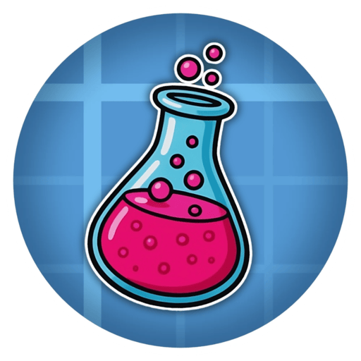

  <h1>Create: Mad Lab</h1>
  
<strong>Create-powered lab automation and risky consumables for Minecraft.</strong>

  

    <a href="https://curseforge.com/minecraft/mc-mods/create-mad-lab">CurseForge</a>
    |
    <a href="https://modrinth.com/mod/create-mad-lab">Modrinth</a>
  

> This mod does not promote real life drug use. Note that the chemistry is often intentionally inaccurate to avoid legal troubles.

## Features

- **Drugs:** four consumables that have visual effects as well as special behaviors.
- **Ergot crop infestation**: mature wheat can become infested with ergot fungus. Rain, recent rainfall, biome temperature, and nearby infected crops affect the chance of infestation.
- **Create machine recipes**: dozens of recipes use Create mixing, filling, compacting, crushing, and pressing to support multi-step lab production lines.
- **Lab equipment**: includes syringes, 100 mB flasks, and reusable catalyst items.
- **Food lacing**: most edible items can be filled with these questionable substances. Laced food keeps its normal food behavior while also applying the stored effect when eaten.

## Gameplay Effects

- **LSD (Exciting Paper)**: applies a long psychedelic visual effect with dose-scaled intensity.
- **Heroin (Bliss)**: applies a sedating visual effect, and makes hostile mobs neutral to the player.
- **Morphine**: converts some incoming damage into unstable hearts that drain over time.
- **Fentanyl (Void)**: starts an escalating overdose sequence with heavy screen effects and a fatal endpoint.
- **Naloxone**: used to counter opiates like Heroin, Morphine or Fentanyl. Withdrawal effects still apply.

*JEI or another recipe viewer is recommended because the mod adds a lot of Create processing recipes.*

  Made by Buda1bb

